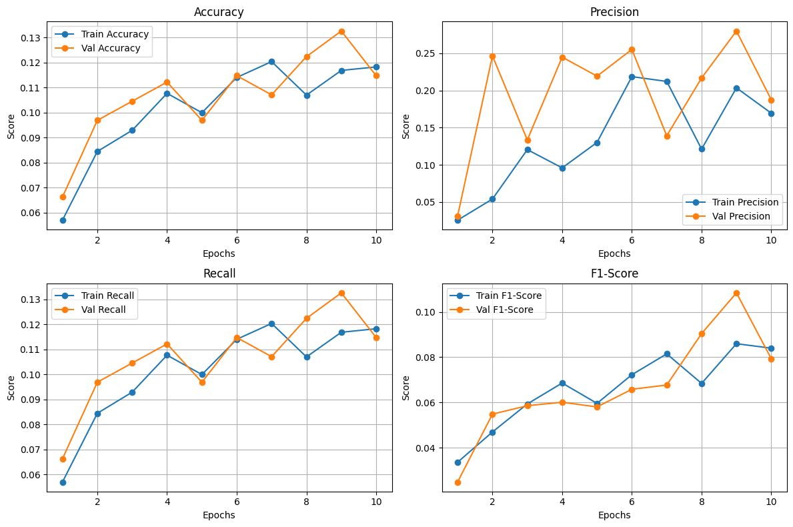

# Техническое задание на позицию ML Developer, 2025 год

Данная модель выполняет задачи классификации логотипов компаний

### Структура модели

# CNN - ResNet18
# OCR - pytesseract

# Источник данных
https://www.kaggle.com/datasets/siddharthkumarsah/logo-dataset-2341-classes-and-167140-images

## Показатели основных метрик

